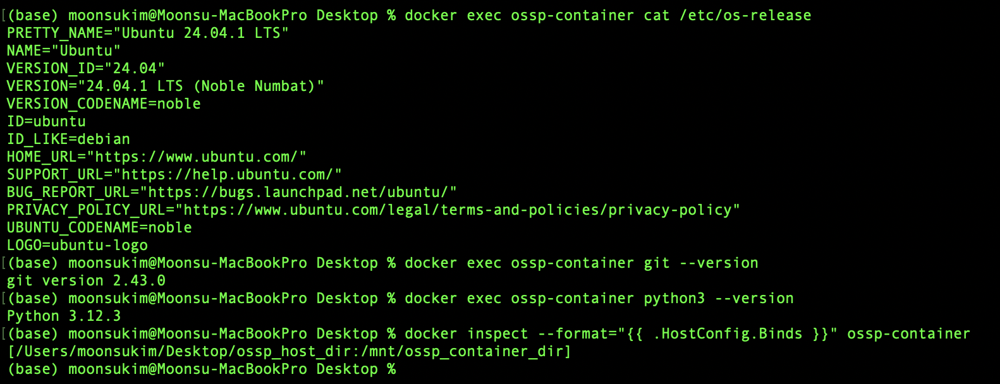

# **SWE_2021_41_2024_2_week_6**
## __Week 4 Assignment__
### Week 4 repository
> https://github.com/kimmail99/SWE_2021_41_2024_2_week_4.git

### CODE
```python
def isHappy(n):
  seen = set()
  while(n != 1):
    current_sum = 0
    while(n > 0):
      digit = n % 10
      current_sum += digit * digit
      n //= 10
    n = current_sum
    if n in seen:
      return False
    seen.add(n)
  return True

# Example usage:
# isHappy(19) returns True
```

### Description

##### Problem description
* The task was to create an algorithm to determine if a given number `n` is a __"happy number."__
+ A happy number is defined by the following process:
1. Start with any positive integer.
2. Replace the number by the sum of the squares of its digits.
3. Repeat the process until the number either equals 1 (indicating it is a happy number) or falls into a repeating cycle that does not include 1 (indicating it is not a happy number).
4. Return `True` if the number is happy, otherwise return `False`.

##### Code descriptoin
> ```python
>     # Create a set to store seen numbers to detect cycles
>     seen = set()

> ```python
>     # Loop until n becomes 1 (happy number) or a cycle is detected
>     while(n != 1):

> ```python
>         # Calculate the sum of the squares of the digits of n
>         while(n > 0):
>             digit = n % 10
>             current_sum += digit * digit
>             n //= 10

> ```python
>         # Update n to the current sum
>         n = current_sum

> ```python
>         # If n has been seen before, it's a cycle and n is not a happy number
>         if n in seen:

> ```python
>         # Add n to the set of seen numbers
>         seen.add(n)

> ```python
>     # If n becomes 1, it is a happy number
>     return True

## __Week 5 Assignment__
### Week 5 jpg
>
### Commands Executed
1. **Check OS Version**
   ```
   $ docker exec ossp-container cat /etc/os-release
   ```
> Explanation: This command runs cat /etc/os-release inside the ossp-container to display details about the operating system, such as its name, version, and release information.
>> Result: The container is running Ubuntu 24.04.1 LTS (Noble Numbat).

2. **Check Git Version**
   ```
   $ docker exec ossp-container git --version
   ```
> Explanation: This command runs git --version inside the container to check the installed version of Git, which is useful for ensuring compatibility with version control processes.
>> Result: Git version 2.43.0.

3. **Check Python Version**
   ```
   docker exec ossp-container python3 --version
   ```
> Explanation: This command runs python3 --version inside the container to check the installed version of Python, which is important for running Python-based scripts and applications.
>> Result: Python 3.12.3.

4. **Check Container Bind Mounts**
   ```
   docker inspect --format="{{ .HostConfig.Binds }}" ossp-container
   ```
> Explanation: This command uses docker inspect to check the bind mounts configured for the container. Bind mounts are used to share directories between the host and the container, allowing for persistent data storage and sharing files between environments.
>> Result: Bind mount from host /Users/moonsukim/Desktop/ossp_host_dir to container /mnt/ossp_container_dir.
